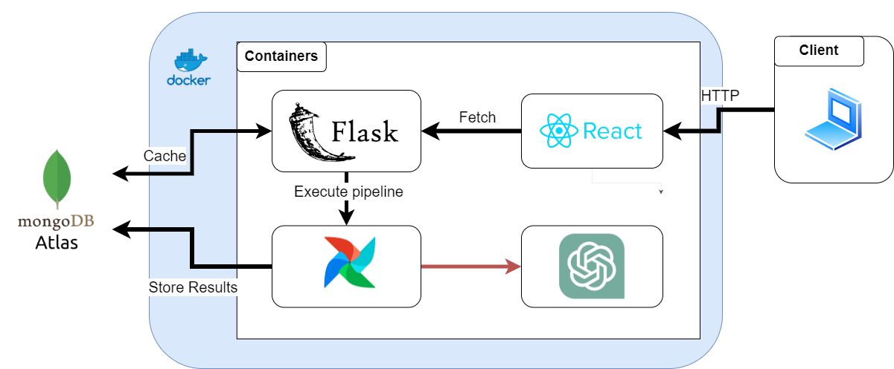
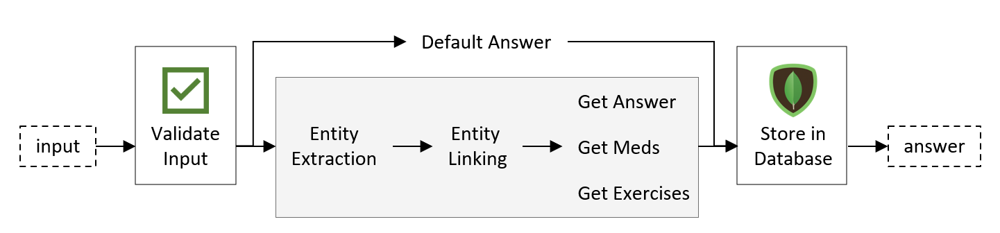

# Physio

A conversational AI agent to help with physical rehabilitation.

## System Architecture

Physio is a web application developed using microservice architecture to improve scalability and enforce failure isolation. The frontend is developed in React which enables the creation of maintainable interfaces through its reusable components mechanism, effectively separating the logic from the visual interfaces. The backend makes use of Apache Airflow and consists of a data processing pipeline that effectively manages the workflow of incoming requests. Between these two services, there is a Flask server serving as a gateway for the web application. It is responsible for receiving the requests made by the client, triggering the Airflow data pipeline for execution, and storing the answers in an external database. All these services are packaged in Docker containers and aggregated on a Docker compose file for interoperability and fast deployment. For the database, we employ MongoDB to store the knowledge bases we compiled. For the generative model, Physio relies on OpenAI GPT-4 model which is the most effective LM at the time of development of this demo.

## Setup

### ML Pipeline

Check out the backend [README](backend/README.md) to set up the environment.

#### Webscraping Sources

When formulating its responses, Physio relies on and references the following websites:

* [physio-pedia](www.physio-pedia.com)
* [ncbi.nlm.nih](www.ncbi.nlm.nih.gov)
* [my.clevelandclinic](www.my.clevelandclinic.org)
* [healthline](www.healthline.com)
* [webmd](www.webmd.com)
* [orthoinfo.aaos](www.orthoinfo.aaos.org)
* [mayoclinic](www.mayoclinic.org)
* [sciencedirect](www.sciencedirect.com)
* [hopkinsmedicine](www.hopkinsmedicine.org)
* [medicalnewstoday](www.medicalnewstoday.com)
* [nhs](www.nhs.uk)
* [orthobullets](www.orthobullets.com)
* [pubmed.ncbi.nlm.nih](www.pubmed.ncbi.nlm.nih.gov)
* [hss](www.hss.edu)
* [emedicine.medscape](www.emedicine.medscape.com)
* [sportdoctorlondon](www.sportdoctorlondon.com)
* [sportsinjuryclinic](www.sportsinjuryclinic.net)
* [spine-health](www.spine-health.com)
* [verywellhealth](www.verywellhealth.com)
* [bupa.co](www.bupa.co.uk)

### React Demo

The project is built using Docker. Please ensure you are familiar with Docker before executing the commands below.

### How to Run

**Inside the frontend folder:**

1. Create a `.env.local` file in the same directory as `.env.example`.

2. Inside the `.env.local` file, specify the desired port number (e.g., 39872).

3. Ensure that the port defined in the React service of your Docker Compose file matches the port specified in `.env.local`.

4. Run `docker-compose up --build`.

## Contributing

1. Create your feature branch (`git checkout -b feature/fooBar`)
2. Commit your changes (`git commit -am 'Add some fooBar'`)
3. Push to the branch (`git push origin feature/fooBar`)
4. Create a new Pull Request
